# Pagergotchi

A port of [Pwnagotchi](https://github.com/jayofelern/pwnagotchi) for the Hak5 WiFi Pineapple Pager.


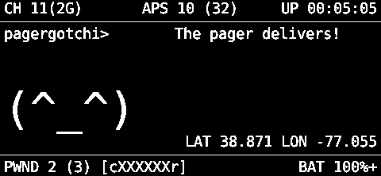

## Features

- **Automated WiFi Handshake Capture** - PMKID and 4-way handshake attacks
- **Cute ASCII Pet** - Personality-driven face that reacts to activity
- **Native Display** - Fast C library rendering via libpagerctl.so
- **Non-Blocking Pause Menu** - Change settings while attacks continue in background
- **Theme System** - 4 visual themes (Default, Cyberpunk, Matrix, Synthwave)
- **Brightness Control** - Adjustable screen brightness (20-100%)
- **Privacy Mode** - Obfuscates MACs, SSIDs, and GPS on display
- **GPS Support** - Optional GPS logging in WiGLE-compatible format
- **Whitelist & Blacklist** - Fine-grained target control with BSSID support
- **WiGLE Integration** - Export captures for WiGLE database uploads
- **Self-Contained** - All dependencies bundled, only requires Python3

## Installation

1. Clone or download this repository

2. Copy the `pagergotchi` folder to your Pager's payloads directory:
   ```bash
   scp -r payloads/user/reconnaissance/pagergotchi root@172.16.52.1:/root/payloads/user/reconnaissance/
   ```

3. The payload will appear in the Pager's payload menu under **Reconnaissance > Pagergotchi**

4. On first run, Python3 will be auto-installed if needed

## Controls

| Button | Action |
|--------|--------|
| **GREEN (A)** | Select / Confirm |
| **RED (B)** | Back / Pause Menu |
| **UP / DOWN** | Navigate menus |
| **LEFT / RIGHT** | Toggle options / Cycle values |

## Payload Launch

When you select Pagergotchi from the payload menu, you'll see the launch screen:

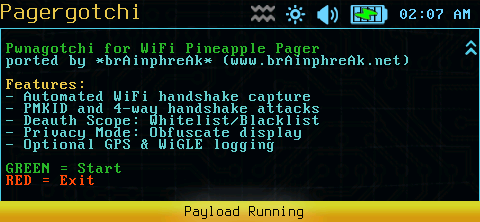

Press **GREEN** to start or **RED** to exit.

## Startup Menu

The startup menu provides these options:


- **Start Pagergotchi** - Begin automated operation
- **Deauth Scope** - Configure whitelist/blacklist
- **Privacy** - Toggle display obfuscation (ON/OFF)
- **WiGLE** - Toggle WiGLE CSV logging (ON/OFF)
- **Log APs** - Toggle AP discovery logging (ON/OFF)
- **Clear History** - Reset attack tracking for all networks

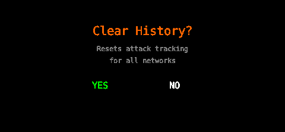

## Main Display

Once started, Pagergotchi shows the main hunting display:

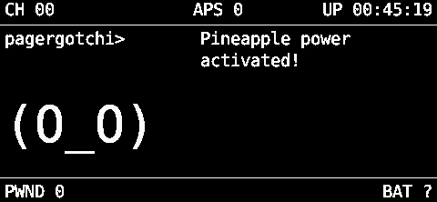

The display shows:
- Channel and AP count
- Uptime
- Status messages and personality
- ASCII face that reacts to activity
- GPS coordinates (if available)
- PWND count and battery status

| Discovering APs | Client Found |
|-----------------|--------------|
|  | 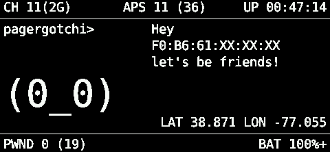 |

| Deauthing | Handshake Captured |
|-----------|-------------------|
| 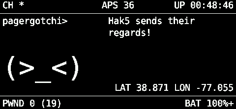 |  |

## Pause Menu

Press **RED** at any time during operation to open the pause menu. The agent continues capturing handshakes in the background while the menu is displayed.

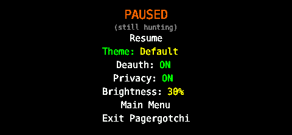

- **Resume** - Return to main display
- **Theme** - Cycle through visual themes (LEFT/RIGHT to cycle)
- **Deauth** - Toggle deauth attacks (ON/OFF)
- **Privacy** - Toggle privacy mode (ON/OFF)
- **Brightness** - Adjust screen brightness (LEFT/RIGHT, 20-100%)
- **Main Menu** - Return to startup menu (stops current session)
- **Exit Pagergotchi** - Cleanly exit to Pager launcher

### Themes

| Theme | Description |
|-------|-------------|
| **Default** | Classic black & white |
| **Cyberpunk** | Cyan and pink neon |
| **Matrix** | Green phosphor terminal |
| **Synthwave** | Purple and pink retro |

| Default | Cyberpunk |
|---------|-----------|
| 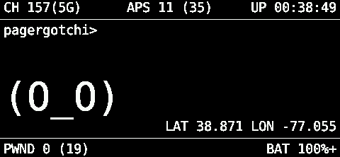 | 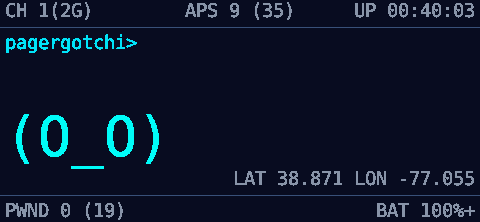 |

| Matrix | Synthwave |
|--------|-----------|
| 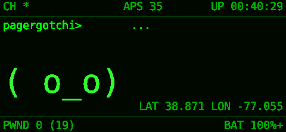 | 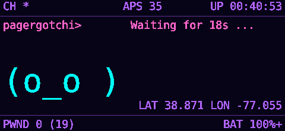 |

## Deauth Scope

Control which networks are targeted:

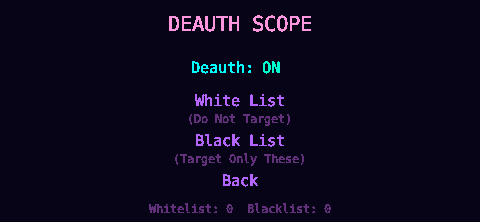

### Whitelist (Do Not Target)
Networks added here will never be attacked. Use for:
- Your home WiFi
- Phone hotspots
- Work networks

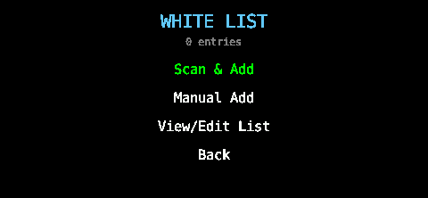

### Blacklist (Target Only These)
When populated, ONLY these networks will be attacked. Use for:
- Authorized penetration testing
- Specific target assessments

### Adding Networks

| Scan & Add | Manual Add |
|------------|------------|
| 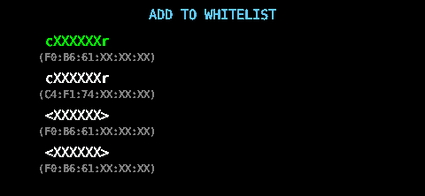 | 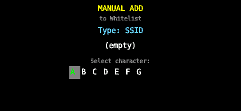 |

- **Scan & Add** - Scan nearby networks and select from list
- **Manual Add** - Enter SSID or BSSID directly
- **View/Edit** - Remove entries from lists

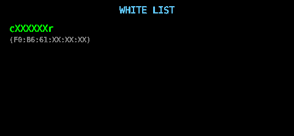

Both SSID and BSSID are stored, so networks are matched even if they hide their SSID.

## Privacy Mode

When enabled, sensitive data is obfuscated on the display:

| Data Type | Example | Obfuscated |
|-----------|---------|------------|
| SSID | `MyNetwork` | `MXXXXXXK` |
| MAC/BSSID | `AA:BB:CC:11:22:33` | `AA:BB:CC:XX:XX:XX` |
| GPS | (any coordinates) | `LAT 38.871 LON -77.055` |

Privacy mode always displays fixed fake coordinates (the Pentagon) regardless of actual GPS location.

## GPS Support

If a USB GPS device is connected, Pagergotchi will:
- Display coordinates on the main screen
- Log GPS data with captured handshakes
- Generate WiGLE-compatible CSV files (if WiGLE enabled)

GPS only appears on display when:
- A GPS device is connected and has a fix, OR
- Privacy mode is enabled (shows fake coordinates)

## Data Storage

### Payload Directory (settings & config)
All settings and configuration stay within the payload directory:

| File | Contents |
|------|----------|
| `config.conf` | User configuration |
| `data/settings.json` | Runtime settings (theme, privacy, deauth, lists) |
| `data/recovery.json` | Attack history for all networks |
| `data/session.json` | Last session statistics |

### Loot Directory (captured data)
Captured data goes to the standard Pager loot location:

| Path | Contents |
|------|----------|
| `/root/loot/handshakes/` | Captured .pcap and .22000 files |
| `/root/loot/wigle/` | WiGLE CSV exports |
| `/root/loot/ap_logs/` | AP discovery logs |

## Configuration

Edit `config.conf` for persistent settings:

```ini
[general]
debug = false

[capture]
interface = wlan1mon

[channels]
# Leave empty for all 2.4/5/6GHz bands, or specify: 1,6,11
channels =

[whitelist]
# Use on-screen menu for easier management with BSSID support
ssids =

[deauth]
enabled = true

[timing]
throttle_d = 0.9
throttle_a = 0.4
```

Runtime settings (theme, privacy, etc.) are saved to `data/settings.json`.

## File Structure

### Repository Layout
```
pineapple_pager_pagergotchi/
├── README.md                # This file
├── screenshots/             # Documentation images
└── payloads/
    └── user/
        └── reconnaissance/
            └── pagergotchi/     # <- Copy this folder to your Pager
```

### Payload Contents
```
pagergotchi/
├── payload.sh           # Main entry point
├── run_pagergotchi.py   # Python launcher
├── config.conf          # User configuration
├── data/                # Runtime data (auto-created)
│   ├── settings.json    # Persistent settings
│   └── recovery.json    # Attack history
├── fonts/               # TTF fonts for display
├── lib/                 # Native libraries & Python packages
│   ├── libpagerctl.so   # Native display library
│   └── pagerctl.py      # Python bindings
├── bin/                 # Capture tools
└── pwnagotchi_port/     # Main Python module
    ├── main.py          # Entry point & button handling
    ├── agent.py         # AI brain & attack logic
    └── ui/
        ├── view.py      # Main display rendering
        ├── menu.py      # Startup & pause menus
        ├── components.py # UI elements
        └── faces.py     # ASCII face definitions
```

## Technical Details

### Display
- Uses libpagerctl.so for native 480x222 RGB565 rendering
- Double-buffered for flicker-free updates
- TTF font rendering via stb_truetype
- 2 FPS refresh for power saving (menu is instant-response)

### Input
- Thread-safe event queue for reliable button detection
- Non-blocking menu allows background operation
- Debounced input with edge detection

### Attacks
- PMKID capture via association frames
- Deauth for 4-way handshake capture
- Per-AP throttling to avoid detection
- Attack history prevents repeated attempts

## Requirements

- Hak5 WiFi Pineapple Pager
- Python3 (auto-installed if missing)
- Monitor mode capable WiFi adapter (built-in wlan1)

## Credits

- **Author**: brAinphreAk
- **Website**: [www.brAinphreAk.net](http://www.brainphreak.net)
- **Support**: [ko-fi.com/brainphreak](https://ko-fi.com/brainphreak)
- **Based on**: [Pwnagotchi](https://github.com/evilsocket/pwnagotchi) by evilsocket
- **Hardware**: [Hak5 WiFi Pineapple Pager](https://hak5.org)
- **Display Library**: [pagerctl](https://github.com/pineapple-pager-projects/pineapple_pager_pagerctl)

## License

This project is based on Pwnagotchi which is licensed under GPL-3.0.

## Disclaimer

This tool is intended for authorized security testing and educational purposes only. Only use on networks you own or have explicit permission to test. Unauthorized access to computer networks is illegal.
